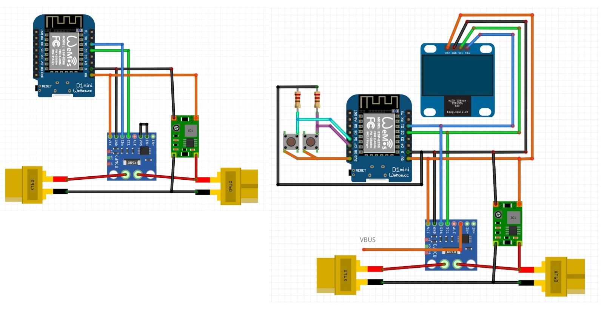
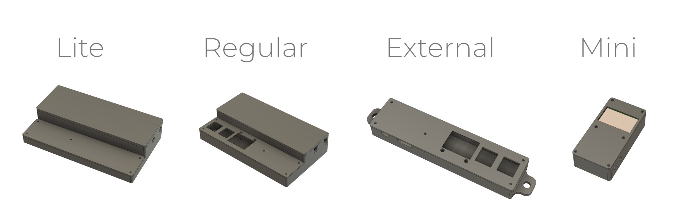

# ESPVMON

Compact voltage and current monitoring device built on ESP8266 and ESP32.  
All source code and enclosure models are available on GitHub.

## Variants

**Lite**  
No input or output interfaces. Configuration and data retrieval are handled in firmware and through the Web API.

**Regular**  
Two-button control and 0.96" OLED display.

**External**  
Same as Regular but uses an external shunt.

**Mini**  
Screen-only output with the smallest enclosure.

Each variant serves a different role. Lite offers reduced power consumption suitable for battery operation. External works with large, high-current shunts. Mini provides a compact desktop tool.

## Hardware

The circuit is minimal and assembled with point-to-point wiring inside the enclosure. No PCB fabrication is required.

## Enclosures

Four enclosure designs were produced during development.

## Firmware

Firmware sources are included in the repository.  
Open the project in Arduino IDE.  

Required Board Manager packages:  
- ESP32  
- ESP8266  

Required libraries:  
- Adafruit_SSD1306  
- GyverINA  
- WiFiManager  

Regular and External versions compile and flash without modification.  
Mini requires enabling `#define MINIMALMODE` to remove button and Wi-Fi support and setting the shunt value manually.
